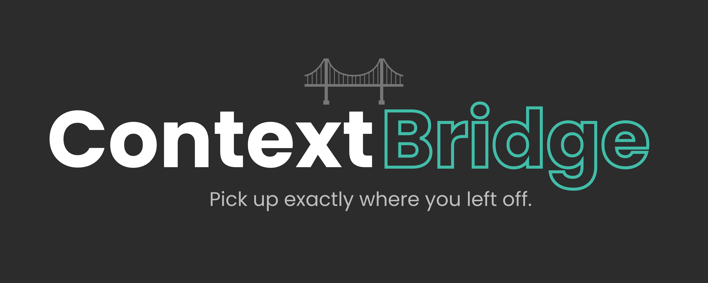

<p align="center">
  
</p>

# ⬡ ContextBridge — AI Continuity Tool

> **Built for the Hackathon** · Internal Tooling · Cost Reduction + Operational Efficiency

---

## The Problem We're Solving

You're deep in a critical conversation with Claude or ChatGPT — debugging a complex system, drafting a proposal, analysing a dataset — and then it happens:

> *"You've reached your message limit. Upgrade to continue."*

Now what? You either wait hours for the limit to reset, switch to a different account, or switch to a different AI model entirely. But every time you start a new session, **the AI has no memory of what you discussed**. You're back to square one — re-explaining the entire context, re-pasting documents, re-setting up the problem.

**This costs us real time and money.** Across a team of 50 engineers and analysts each hitting this wall 2–3 times a week, that's hundreds of hours lost per month to context re-entry alone.

**ContextBridge solves this with one click.**

---

## What It Does

ContextBridge is a lightweight browser extension that adds a persistent **Export** button to any AI chat interface (Claude, ChatGPT, Gemini, Grok, DeepSeek, Mistral). When you're approaching a token/message limit — or simply want to hand off context to a colleague — you export the full conversation as a structured file.

That file then becomes your **context passport**: paste it into any new chat session on any account or model, and the AI instantly has full context of everything that was discussed.

```
Your Current Session          →    Export📄    →    New Session / Account / Model
[All context, decisions,                           [Full context restored in
 code, analysis, progress]                           seconds. Work continues.]
```

---

## The Employee Experience

### Before ContextBridge

1. Hit the message limit mid-task
2. Open a new tab, start fresh session
3. Spend 10–20 minutes re-explaining the problem, re-pasting code, re-establishing context
4. AI makes mistakes because it's missing earlier decisions
5. Repeat the next time you switch models or accounts

### After ContextBridge

1. Hit the message limit mid-task  
2. Click **Export** → choose format (takes 2 seconds)
3. Open a new tab, paste the file, say *"Continue from this context"*
4. AI reads the full history and picks up exactly where you left off
5. Total interruption: **under 60 seconds**

---

## Installation (Developer Mode)

Since this is an internal tool, install it directly without the Chrome Web Store:

1. **Download** this folder (or clone the repo)
2. Open Chrome and go to `chrome://extensions/`
3. Enable **Developer Mode** (toggle, top-right)
4. Click **Load unpacked**
5. Select the `context-bridge` folder
6. Done — the ⬡ icon appears in your toolbar

> **Works on:** Chrome, Brave, Edge (any Chromium-based browser)

---

## How to Use

### Method 1: Floating Button (Recommended)

When you're on any supported AI platform, a small **Export** button appears in the bottom-right corner of the page. Click it to see export options:

| Format | Best For |
|--------|----------|
| **Markdown (.md)** | Pasting directly into new AI chats |
| **Plain Text (.txt)** | Universal — works with any tool |
| **JSON (.json)** | API integrations, automation pipelines |
| **PDF (.html → PDF)** | Sharing with teammates, archiving |

### Method 2: Extension Popup

Click the ⬡ icon in your browser toolbar to see:
- Current platform detected (Claude / ChatGPT / Gemini / Grok / DeepSeek / Mistral)
- Message count and estimated token usage
- **Context window meter** — how much of the current session's token limit is used
- One-click export buttons for all four formats

---

## Context Window Meter

The popup displays a live progress bar showing how much of the platform's context window your current conversation is consuming:

- 🟢 **Under 80%** — you're fine, keep going
- 🟡 **80–94%** — getting full, consider exporting soon
- 🔴 **95%+** — context nearly full, export now before you hit the wall

> **Note:** Token counts are estimated from visible message text (approx. 4 characters = 1 token). Limits shown are conservative free-tier context window sizes. Actual limits vary by account plan and model version.

---

## Resuming Context in a New Chat

After exporting, open a new chat session and paste this resume prompt:

**Quick version:**
```
I'm continuing a previous AI conversation. Here is the full transcript — please review it and be ready to continue where we left off.

[paste file contents here]
```

**For complex work sessions:**
```
I'm resuming a work session that was interrupted due to token limits.
Below is the full conversation history. Please:
1. Acknowledge you've read the context
2. Summarise the last decision/task we were on
3. Continue from that point

[paste file contents here]
```

---

## Supported Platforms

| Platform | URL | Status |
|----------|-----|--------|
| Claude | claude.ai | ✅ Fully supported |
| ChatGPT | chatgpt.com | ✅ Fully supported |
| Gemini | gemini.google.com | ✅ Fully supported |
| OpenAI Legacy | chat.openai.com | ✅ Fully supported |
| Grok | grok.com / x.com | ✅ Supported |
| DeepSeek | chat.deepseek.com | ✅ Supported |
| Mistral | chat.mistral.ai | ✅ Supported |

---

## Export Formats

### Markdown (.md)
Best for pasting directly into new AI chat sessions. Includes a formatted resume prompt header, token usage summary, and the full conversation.

### Plain Text (.txt)
Universal format. Readable by every tool and every AI. Includes token usage warnings if context is running high.

### JSON (.json)
Structured export with full metadata. Ideal for building integrations, feeding into internal pipelines, or logging conversations programmatically.

### PDF (via HTML)
Exports a fully styled `.html` file to your downloads folder. Open it in any browser and press `Ctrl+P` → **Save as PDF**. The PDF includes a token usage bar, conversation history, and a resume prompt — useful for sharing with teammates or archiving completed sessions.

---

## Business Case

### Cost Reduction
- **Before:** Employees upgrade personal accounts to avoid limits → shadow IT spend
- **After:** Free-tier accounts used efficiently by bridging sessions → $0 extra spend

### Operational Efficiency
- Estimated **15–25 minutes saved per context-loss event**
- Across a team of 50, hitting this 2–3× per week: **~150 hours/month recovered**
- No more "let me re-explain everything" meetings or messages

### Revenue Enablement
- Client-facing teams (sales, consulting) maintain consistent AI context across long engagements
- No dropped context = fewer mistakes in client deliverables

---

## Privacy & Security

- **All processing is local.** No data is sent to any external server.
- The extension reads only the visible text on the current AI chat page.
- Exported files are saved directly to your local machine.
- No account credentials are accessed or stored.
- The extension has zero telemetry.

---

## Export File Structure (JSON format)

```json
{
  "meta": {
    "title": "API Integration Discussion",
    "platform": "Claude",
    "exportedAt": "2026-05-04T14:32:00Z",
    "messageCount": 24,
    "estimatedTokens": 6200,
    "tokenInfo": {
      "limit": 90000,
      "used": 6200,
      "remaining": 83800,
      "pct": 7,
      "warning": false,
      "critical": false
    },
    "url": "https://claude.ai/chat/...",
    "exportedBy": "ContextBridge v2.0"
  },
  "messages": [
    { "role": "user", "content": "..." },
    { "role": "assistant", "content": "..." }
  ]
}
```

---

## Limitations & Known Issues

### DOM-Based Extraction
ContextBridge reads conversations by querying the **live DOM** of the chat page — it does not use any official API. This means:

- **Claude** is the most fragile. Anthropic frequently updates their front-end, and class names / `data-testid` attributes change with deployments. The extension uses a 5-strategy waterfall to handle this (from specific `data-testid` selectors down to a generic alternating-block fallback), but a major Claude front-end update may break extraction temporarily until selectors are updated.
- **Message count reflects the current DOM**, not the full chat history. If Claude or ChatGPT hasn't rendered older messages (because you haven't scrolled up), they won't be captured. **Scroll to the top of the conversation before exporting** to ensure everything is loaded.
- **Grok, DeepSeek, and Mistral** have less stable DOM structures than Claude or ChatGPT and rely more on heuristic/fallback extraction. Accuracy may vary depending on the platform version.

### Token Estimates
Token counts are estimated (characters ÷ 4). They are directionally accurate but not exact. Different models tokenise differently — GPT-4 and Claude may produce different token counts for the same text.

### PDF Export
PDF export downloads a styled `.html` file. There is no native PDF generation in browser extensions (without bundling a large third-party library). The workflow is: download the `.html` → open in browser → `Ctrl+P` → Save as PDF. This is a one-time 10-second step.

### Free Tier Limits
Context window limits in the token meter are based on known free-tier defaults. Paid plan limits vary significantly and are not currently detected automatically.

---

## Roadmap (Post-Hackathon)

- [ ] **Auto-detect** approaching token limits and prompt export proactively
- [ ] **Team sharing** — export to shared Slack channel or Drive folder
- [ ] **Context compression** — AI-summarised export for very long conversations
- [ ] **Cross-model handoff** — smart prompt reformatting for Claude → ChatGPT switches
- [ ] **Keyboard shortcut** — export without opening any UI
- [ ] **Native PDF generation** — remove the open-in-browser step
- [ ] **API-based extraction** — more reliable than DOM scraping; requires OAuth integration per platform
- [ ] **Selector auto-update** — detect when platform DOM changes and fall back gracefully with a user notification

---

## Project Structure

```
context-bridge/
├── manifest.json         # Extension config (Manifest V3)
├── content.js            # Injected into AI chat pages — extracts messages, renders button
├── content.css           # Styles for floating button and toast notifications
├── background.js         # Service worker — handles file downloads
├── icons/                # Extension icons (16, 32, 48, 128px)
└── popup/
    ├── popup.html        # Toolbar popup UI
    ├── popup.css         # Popup styles
    └── popup.js          # Popup logic — reads page stats, renders token meter, triggers exports
```

---

## Team

Built at the Internal Tools Hackathon · May 2026

*"Why do we do this manually?"* — This project.

---

*ContextBridge is an internal tool. Not affiliated with Anthropic, OpenAI, Google, xAI, DeepSeek, or Mistral.*
