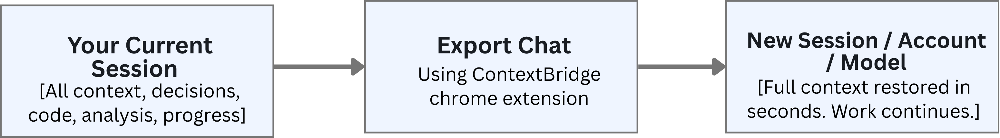
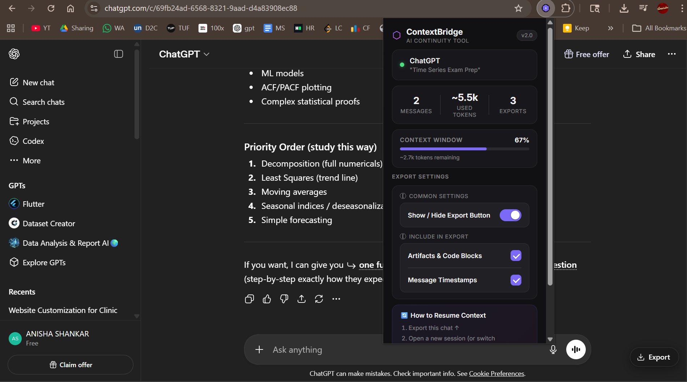
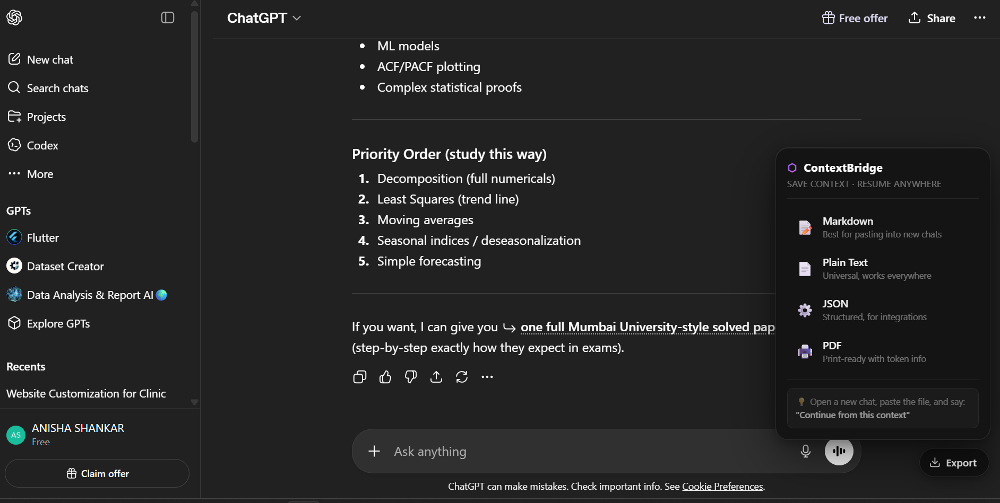
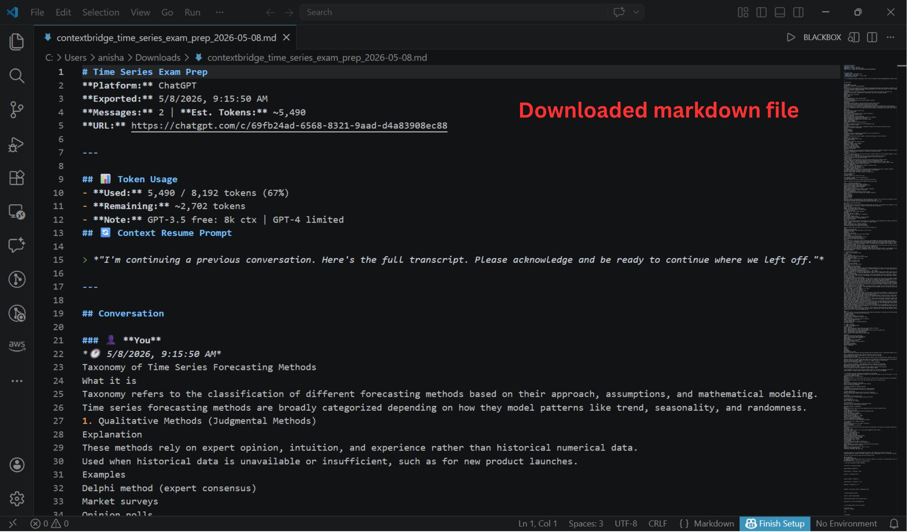

<p align="center">
  
</p>

# ⬡ ContextBridge — AI Continuity Tool

## The Problem We're Solving

AI conversations are disposable by design. When a session ends — whether from a token limit, a platform switch, or a colleague handoff — all the context, reasoning, and outputs are trapped inside one platform with no clean way to extract or reuse them.

**The specific pain points:**

- **Context loss at limits** — You're deep in a critical conversation with Claude or ChatGPT — debugging a complex system, drafting a proposal, analysing a dataset — and then it happens: *"You've reached your message limit."* Every time you start a new session, the AI has no memory of what you discussed. You're back to square one.
- **Ctrl+P is broken** — Browser print captures UI chrome, sidebars, ads, and broken formatting. It's not usable for documentation or sharing.
- **Platform lock-in** — Switching from Claude to ChatGPT (or vice versa) means re-explaining everything from scratch, killing continuity.
- **No native export** — AI platforms don't offer structured export to Markdown, JSON, or PDF. Users resort to copy-paste.
- **Teams can't share AI work** — There's no way to hand off a conversation to a colleague, store it in a doc system, or review it later.
- **Tool fragmentation** — Power users working across Claude, ChatGPT, Gemini, Grok, DeepSeek, and Mistral would need a separate tool for each platform.

**This costs real time and money.** Across a team of 50 engineers and analysts hitting this wall 2–3 times a week, that's hundreds of hours lost per month to context re-entry alone.

**ContextBridge solves this with one click.**

---

## What It Does

ContextBridge is a single Chrome extension that sits on top of every major AI platform and lets you export, save, and port conversations in clean, structured formats — instantly, with no login.

It injects a persistent **Export** button directly into the AI chat UI. When you're approaching a token limit — or simply want to hand off context — you export the full conversation as a structured file. That file becomes your **context passport**: paste it into any new chat session on any account or model, and the AI instantly has full context of everything discussed.

<p align="center">
  
</p>

---

## The Employee Experience

### Before ContextBridge

1. Hit the message limit mid-task
2. Open a new tab, start a fresh session
3. Spend 10–20 minutes re-explaining the problem, re-pasting code, re-establishing context
4. AI makes mistakes because it's missing earlier decisions
5. Repeat every time you switch models or accounts

### After ContextBridge

1. Hit the message limit mid-task
2. Click **Export** → choose format (takes 2 seconds)
3. Open a new tab, paste the file, say *"Continue from this context"*
4. AI reads the full history and picks up exactly where you left off
5. Total interruption: **under 60 seconds**

---
## Implementation Screenshots

<p align="center">
  
</p>
<p align="center">
  
</p>
<p align="center">
  
</p>

---

## Features

### ✦ One-Click Export
Injects a floating **Export** button directly into every supported AI chat UI — no tab switching, no copying. Export the full conversation in your preferred format instantly.

| Format | Best For |
|--------|----------|
| **Markdown (.md)** | Pasting into new AI chats, Notion, Obsidian, GitHub docs |
| **Plain Text (.txt)** | Universal — works with every tool and every AI |
| **JSON (.json)** | API integrations, automation pipelines, logging |
| **PDF (via HTML)** | Sharing with teammates, archiving, client deliverables |

### ✦ True Markdown Export
Not a raw text dump. Output preserves heading hierarchy, code blocks, bold/italic formatting, and full conversation structure — ready to push directly to documentation.

### ✦ PDF That Actually Works
Browser print (`Ctrl+P`) produces ugly, unusable output. ContextBridge generates properly formatted, AI-chrome-free, shareable PDFs from any AI chat. Includes token usage bar, conversation history, and a resume prompt.

### ✦ Context Window Meter
Live progress bar in the popup showing how much of the platform's context window your current conversation is consuming:

- 🟢 **Under 80%** — you're fine, keep going
- 🟡 **80–94%** — getting full, consider exporting soon
- 🔴 **95%+** — context nearly full, export now

### ✦ Cross-Platform Context Portability
The only tool that lets you take a conversation from Claude and continue it on ChatGPT — or any other combination — preserving full context without re-explaining anything.

### ✦ Artifacts Support
Exports Claude artifacts (code blocks, documents) alongside the conversation — not just the chat text.

### ✦ Privacy-First, Zero Login
Everything runs locally in your browser. No conversation data is sent to any server. No account creation, no OAuth, no email, no tracking. Install and use immediately.

### ✦ One Extension, All Platforms
Claude, ChatGPT, Gemini, Grok, DeepSeek, Mistral — one extension covers all of them. No need to install separate tools per platform.

---

## Installation (Developer Mode)

Since this is an internal tool, install it directly without the Chrome Web Store:

1. **Download** this folder (or clone the repo)
2. Open Chrome and go to `chrome://extensions/`
3. Enable **Developer Mode** (toggle, top-right)
4. Click **Load unpacked**
5. Select the `context-bridge` folder
6. Done — the ⬡ icon appears in your toolbar

> **Works on:** Chrome, Brave, Edge (any Chromium-based browser)

---

## How to Use

### Method 1: Floating Button (Recommended)

When you're on any supported AI platform, a small **Export** button appears in the bottom-right corner of the page. Click it to see export options.

### Method 2: Extension Popup

Click the ⬡ icon in your browser toolbar to see:
- Current platform detected (Claude / ChatGPT / Gemini / Grok / DeepSeek / Mistral)
- Message count and estimated token usage
- **Context window meter** — live view of how much of the session's token limit is used
---

## Resuming Context in a New Chat

After exporting, open a new chat session and paste this resume prompt:

**Quick version:**
```
I'm continuing a previous AI conversation. Here is the full transcript — please review it and be ready to continue where we left off.

[paste file contents here]
```

**For complex work sessions:**
```
I'm resuming a work session that was interrupted due to token limits.
Below is the full conversation history. Please:
1. Acknowledge you've read the context
2. Summarise the last decision/task we were on
3. Continue from that point

[paste file contents here]
```

---

## Supported Platforms

| Platform | URL | Status |
|----------|-----|--------|
| Claude | claude.ai | ✅ Fully supported |
| ChatGPT | chatgpt.com | ✅ Fully supported |
| Gemini | gemini.google.com | ✅ Fully supported |
| OpenAI Legacy | chat.openai.com | ✅ Fully supported |
| Grok | grok.com / x.com | ✅ Supported |
| DeepSeek | chat.deepseek.com | ✅ Supported |
| Mistral | chat.mistral.ai | ✅ Supported |

---

## Business Impact

### Time Savings
- Eliminates 5–15 minutes per conversation spent manually copying, formatting, and cleaning AI outputs
- Removes the 10–20 minute "context rebuilding" cost every time a session ends or a model is switched
- For a team of 20 using AI daily, that's **~50 hours/month recovered** purely from export friction
- Removes back-and-forth when sharing AI work with teammates — one click vs. multiple manual steps

### Cost Reduction
- **Before:** Employees upgrade personal accounts to avoid limits → shadow IT spend
- **After:** Free-tier accounts used efficiently by bridging sessions → $0 extra spend
- A single recovered context session (avg. 20 mins) across a 50-person team = **~17 person-hours saved per month**
- Reduces dependency on expensive paid tiers by making free-tier sessions more efficient and reusable

### Revenue & Productivity Enablement
- Sales teams can export AI-generated proposals, email drafts, or research directly to PDF and send — no reformatting
- Engineering teams can export code-heavy conversations to Markdown and push directly to documentation or Notion
- Managers can archive AI-assisted decisions for audit trails and compliance
- Enables **"AI handoffs"** — one person starts a task in AI, exports context, and another picks it up seamlessly
- Client-facing teams maintain consistent AI context across long engagements — fewer mistakes in client deliverables

---

## Revenue Model

### Month 1: Fully Free
All features unlocked for 30 days — builds trust, drives word-of-mouth, removes adoption friction. Goal: get users deeply dependent on the workflow before introducing payment.

### Freemium Tiers (Post Month 1)

| Tier | Price | Key Limits |
|------|-------|------------|
| **Free** | $0/month | 3 PDFs/day, branding on exports |
| **Starter** | ~$1.98/mo (yearly) | 30 PDFs/day, no branding, Mute Export, multi-device |
| **Standard** | ~$2.98/mo (yearly) | 100 PDFs/day, all features, developer support |

**Why this works:**
- Price point is impulse-buy level ($2–4/month) — zero friction for individuals
- Volume limit (PDFs/day) is the natural upgrade trigger for power users
- "Remove branding" is a professional upgrade motivator for teams sharing outputs externally
- "Mute Export" (silent background download, no popup) is a power-user feature that justifies Starter tier
- Future: Team/Enterprise tier with shared workspaces, SSO, and admin export logs — significantly higher ARPU

---

## Privacy & Security

- **All processing is local.** No data is sent to any external server.
- The extension reads only the visible text on the current AI chat page.
- Exported files are saved directly to your local machine.
- No account credentials are accessed or stored.
- The extension has zero telemetry.

---

## Export File Structure (JSON format)

```json
{
  "meta": {
    "title": "API Integration Discussion",
    "platform": "Claude",
    "exportedAt": "2026-05-04T14:32:00Z",
    "messageCount": 24,
    "estimatedTokens": 6200,
    "tokenInfo": {
      "limit": 90000,
      "used": 6200,
      "remaining": 83800,
      "pct": 7,
      "warning": false,
      "critical": false
    },
    "url": "https://claude.ai/chat/...",
    "exportedBy": "ContextBridge v2.0"
  },
  "messages": [
    { "role": "user", "content": "..." },
    { "role": "assistant", "content": "..." }
  ]
}
```

---

## Limitations & Known Issues

### DOM-Based Extraction
ContextBridge reads conversations by querying the **live DOM** of the chat page — it does not use any official API. This means:

- **Claude** is the most fragile. Anthropic frequently updates their front-end, and class names / `data-testid` attributes change with deployments. The extension uses a 5-strategy waterfall to handle this (from specific `data-testid` selectors down to a generic alternating-block fallback), but a major Claude front-end update may break extraction temporarily until selectors are updated.
- **Message count reflects the current DOM**, not the full chat history. If Claude or ChatGPT hasn't rendered older messages (because you haven't scrolled up), they won't be captured. **Scroll to the top of the conversation before exporting** to ensure everything is loaded.
- **Grok, DeepSeek, and Mistral** have less stable DOM structures and rely more on heuristic/fallback extraction. Accuracy may vary depending on the platform version.

### Token Estimates
Token counts are estimated (characters ÷ 4). They are directionally accurate but not exact. Different models tokenise differently — GPT-4 and Claude may produce different token counts for the same text.

### PDF Export
PDF export downloads a styled `.html` file. The workflow is: download the `.html` → open in browser → `Ctrl+P` → Save as PDF. This is a one-time 10-second step.

### Free Tier Limits
Context window limits in the token meter are based on known free-tier defaults. Paid plan limits vary significantly and are not currently detected automatically.

---

## Roadmap (Post-Hackathon)

- [ ] **Context limit alerts** — Proactively notify you when the token limit is almost full, so you can export and continue before losing context mid-conversation
- [ ] **Smart summarisation before export** — Auto-generate a TL;DR at the top of your export — full transcript + clean summary in one file, ready to share
- [ ] **AI support for better prompt writing** — Real-time prompt suggestions as you type, helping you get better AI responses without needing to know how to prompt well
- [ ] **Claude Wrapped** — A monthly/yearly visual report of your AI usage: platforms used, tokens consumed, top topics, and productivity stats. Like Spotify Wrapped, but for your AI life
---

## Project Structure

```
context-bridge/
├── manifest.json           # Extension config (Manifest V3)
├── content.js              # Injected into AI chat pages — extracts messages, renders button
├── content.css             # Styles for floating button and toast notifications
├── background.js           # Service worker — handles file downloads
├── claude-wrapped.js       # Claude Wrapped module — usage summary overlay (Claude only)
├── icons/                  # Extension icons (16, 32, 48, 128px)
└── popup/
    ├── popup.html          # Toolbar popup UI
    ├── popup.css           # Popup styles
    └── popup.js            # Popup logic — reads page stats, renders token meter, triggers exports
```

---

## Team

<p align="left">
  <a href="mailto:teaminspire2226@gmail.com">
    
  </a>
</p>

- [Tejas Gadge](https://www.linkedin.com/in/tejas-gadge-8a395b258/)
- [Anisha Shankar](https://www.linkedin.com/in/anisha-shankar-/)

---

*ContextBridge is an internal tool. Not affiliated with Anthropic, OpenAI, Google, xAI, DeepSeek, or Mistral.*
